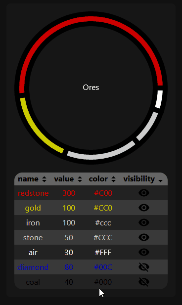

This project was bootstrapped with [Create React App](https://github.com/facebook/create-react-app). 
See the documentation for more details.
## Available Scripts

In the project directory, you can run:
### `npm install`
Install all the dependencies required for the project.

### `npm start`

Runs the app in the development mode. 
Open [http://localhost:3000](http://localhost:3000) to view it in the browser.

The page will reload if you make edits. 
You will also see any lint errors in the console.

## The App

This App is a "sandbox" app, it's a mixture of ReactJS components for personal development purpose. 
It uses video games data (in this case Minecraft) provided by an API (OpenBrother). 

### PieCardComponent

This component is made for visualize statistic data (PieChart).
<table>
<tr>
<td>
<strong>Sorting Table</strong>

</td>
<td>
<strong>Sorting Table</strong>

</td>
</tr>
</table>
